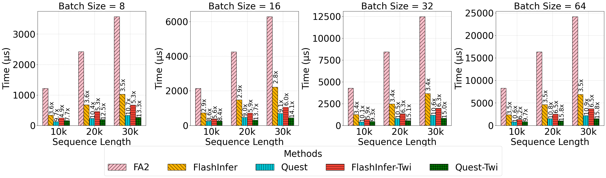

<div align="center">

<h1>Twilight: Adaptive Attention Sparsity with Hierarchical Top-$p$ Pruning</h1>
</div>
<div align="center">
<b><a href="https://chaofanlin.com/">Chaofan Lin</a></b><sup>1</sup>,
<b><a href="https://jiamingtang.me/">Jiaming Tang</a></b><sup>2</sup>,
<b><a href="https://andy-yang-1.github.io/">Shuo Yang</a></b><sup>3</sup>,
<b><a href="https://github.com/WANGHanshuo1220">Hanshuo Wang</a></b><sup>4</sup>,
<b><a href="https://github.com/tang-t21">Tian Tang</a></b><sup>1</sup>,
<br>
<b><a href="https://people.eecs.berkeley.edu/~istoica/">Ion Stocia</a></b><sup>3</sup>,
<b><a href="https://hanlab.mit.edu/songhan/">Song Han</a></b><sup>2</sup>,
<b><a href="https://people.iiis.tsinghua.edu.cn/~gaomy/index.html">Mingyu Gao</a></b><sup>14</sup>
</div>
<div align="center">
<sup>1</sup>Tsinghua University
<sup>2</sup>MIT
<sup>3</sup>UC Berkely
<sup>4</sup>Shanghai Qizhi Institute
</div>

<div align="center">
<a href="https://arxiv.org/abs/2502.02770">[Paper]</a> | 
<a href="https://github.com/tsinghua-ideal/Twilight">[Code]</a> | 
<a href="">[Flash-TopK-Attention (Stay Tuned)]</a><br><br>
</div>


Twilight is a composable optimizer to accelerate **any existing top-$k$ sparse decoding methods** through hierarchical top-$p$ pruning, making them efficient and **budget-adaptive**.

## Key Design: Optimizing Current Algorithm via Hierarchical Top-p Pruning

Traditional top-$k$ based sparse attention can be unified into a **Select-then-SpAttn** architecture, where:
- **Selector**: usually consists of a fast $q \cdot k$ approximation and a `topk` operator to filter out the indices.
- **Sparse Attention**: a.k.a Paged Attention, which takes the selected indices as inputs and then calculates the attention **only on** these tokens.

However, they usually use a fixed budget $k$ of how many tokens to use in their computations. Twilight hacks into the unified architecture by adding a **Pruner** component right after the Selector called **Select-then-Prune** architecture in our paper. 

By first selecting tokens using a conservative budget using the basic algorithms' Selector and then purning them using top-$p$ pruner, Twilight optimize them with adaptive budget decision capabilities without sacrificing accuracy.


## Installation

```bash
conda create -n twi python=3.10
conda activate twi
pip install -r requirements.txt
pip install -e .
```

## Accuracy & Efficiency

Twilight accelerates SOTA methods like [Quest](https://github.com/mit-han-lab/Quest), [Double Sparse](https://github.com/andy-yang-1/DoubleSparse/tree/main) with nearly zero accuracy loss.
| Methods | Longbench (w/o Twilight) | Longbench (w/ Twilight) | Avg. Budget After Pruned |
| ------- | ----------- |----------- |----------- |
| Full (32k)   |  36.78      | **38.52(+4.7\%)** | 146 |
| Quest (8192 budget)  | 37.10 | **38.04(+2.5\%)** | 131 |
| DS (8192 budget)     | 36.62 | **38.71(+5.7\%)**| 126 |

\* Results on Longchat-7B-v1.5-32k



## Citation

If you find Twilight useful or relevant to your project and research, please kindly cite our paper:
```bibtex
@article{lin2025twilight,
  title={Twilight: Adaptive Attention Sparsity with Hierarchical Top-$ p $ Pruning},
  author={Lin, Chaofan and Tang, Jiaming and Yang, Shuo and Wang, Hanshuo and Tang, Tian and Tian, Boyu and Stoica, Ion and Han, Song and Gao, Mingyu},
  journal={arXiv preprint arXiv:2502.02770},
  year={2025}
}
```

## Acknowledgement

We learned the designs/optimizations and reused code from the following projects: [FlashInfer](https://github.com/flashinfer-ai/flashinfer), [Quest](https://github.com/mit-han-lab/Quest), [Atom](https://github.com/efeslab/Atom), [FasterTransformer](https://github.com/NVIDIA/FasterTransformer), [QServe](https://github.com/mit-han-lab/omniserve). We also thank reserach projects like [DuoAttention](https://github.com/mit-han-lab/duo-attention), [PyramidKV](https://github.com/Zefan-Cai/KVCache-Factory), [Ada-KV](https://github.com/FFY0/AdaKV) and [MagicPIG](https://github.com/Infini-AI-Lab/MagicPiG) for bringing the ideas of dynamic budgets across different levels and breaking the limitations of top-$k$ attention.
