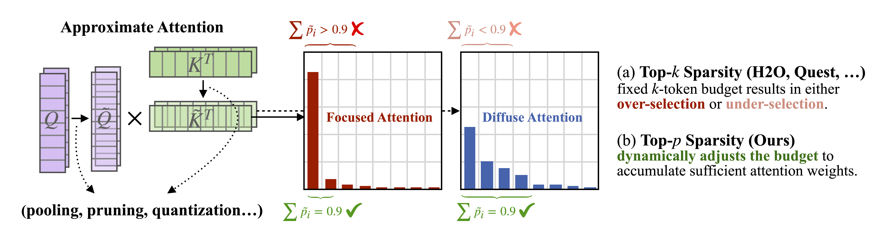
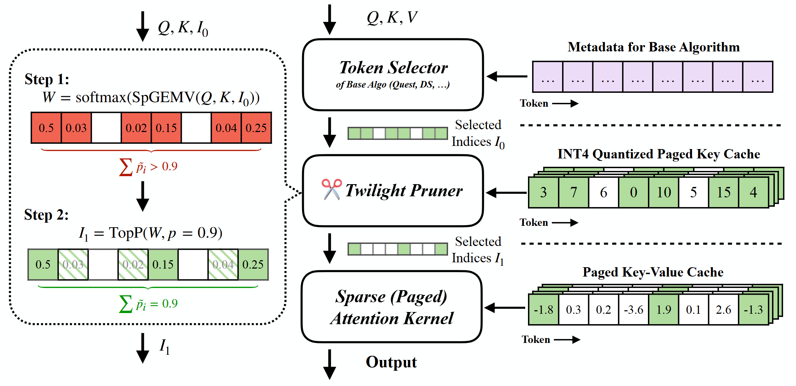
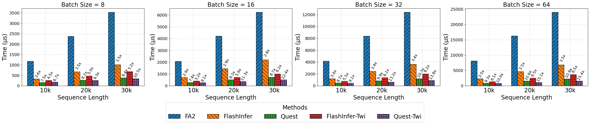

# Twilight: Adaptive Attention Sparsity with Hierarchical Top-$p$ Pruning

[[Paper (Stay Tuned)]()]

Twilight is a composable optimizer to accelerate **any existing sparse decoding methods** through hierarchical top-$p$ pruning, making them **efficient** and **budget-adaptive**.

## Abstract

Leveraging attention sparsity to accelerate long-context large language models (LLMs) has been a hot research topic. However, current algorithms such as sparse attention or key-value (KV) cache compression tend to use a fixed budget, which presents a significant challenge during deployment because it fails to account for the dynamic nature of real-world scenarios, where the optimal balance between accuracy and efficiency can vary greatly. In this paper, we find that borrowing top-$p$ sampling (nucleus sampling) to sparse attention can surprisingly achieve adaptive budgeting. Based on this, we propose Twilight, a framework to bring adaptive sparsity to any existing sparse attention algorithm without sacrificing their accuracy. Empirical results show that Twilight can adaptively prune at most **98\%** of redundant tokens, leading to $15.4\times$ acceleration in self-attention operations and $3.9\times$ acceleration in end-to-end per token latency in long context LLM decoding.

## Optimizing Current Algorithm via Hierarchical Top-$p$ Pruning

## Accuracy & Efficiency

Twilight accelerates SOTA methods like [Quest](https://github.com/mit-han-lab/Quest), [Double Sparse](https://github.com/andy-yang-1/DoubleSparse/tree/main) with nearly zero accuracy loss.
| Methods | Longbench (w/o Twilight) | Longbench (w/ Twilight) | Avg. Budget After Pruned |
| ------- | ----------- |----------- |----------- |
| Full (32k)   |  36.78      | **38.52(+4.7\%)** | 146 |
| Quest (8192 budget)  | 37.10 | **38.04(+2.5\%)** | 131 |
| DS (8192 budget)     | 36.62 | **38.71(+5.7\%)**| 126 |

\* Results on Longchat-7B-v1.5-32k

## Acknowledgement

We learned the design and reused code from the following projects: [FlashInfer](https://github.com/flashinfer-ai/flashinfer), [Quest](https://github.com/mit-han-lab/Quest), [Atom](https://github.com/efeslab/Atom).